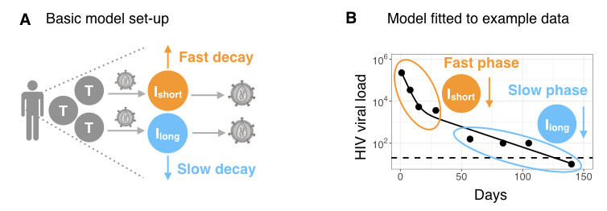

```{r setup, include=FALSE}

knitr::opts_chunk$set(echo = TRUE, fig.height = 6, fig.width = 8, message = FALSE, warning = FALSE)

```

## Introduction

In 2017, HIV/AIDS was responsible for the deaths of one million people globally, including 50,000 children less than one year old [@GBD2017paper, @GBD2017web]. Although mathematical modeling has provided important insights into the dynamics of HIV infection during anti-retroviral treatment (ART), there is still a lack of accessible tools for researchers unfamiliar with modeling techniques to apply them to their own datasets. 

`ushr` is an open-source R package that models the decline of HIV during ART using a popular mathematical framework. The package can be applied to longitudinal data of viral load measurements, and automates all stages of the model fitting process. By mathematically fitting the data, important biological parameters can be estimated, including the lifespans of short and long-lived HIV-infected cells, and the time to suppress viral load below a defined detection threshold. The package also provides visualization and summary tools for fast assessment of model results.

Overall, we hope `ushr` will increase accessibility to mathematical modeling techniques so that greater insights on HIV infection and treatment dynamics may be gained.

## Author and Contributors

Sinead E Morris (author and maintainer), Luise Dziobek-Garrett (contributer) and Andrew J Yates (contributer).


## Citing this package

Citation information can be found using `citation("ushr")`; updated citations will be available in the upcoming paper: Morris SE et al. "ushr: understanding suppression of HIV in R".


## Getting further information

If you encounter any bugs related to this package please contact the package author directly. Additional descriptions of the model and analysis performed by the package can be found in the vignette; details will also be available in the upcoming paper: Morris SE et al. "ushr: understanding suppression of HIV in R" (manuscript available upon request). Further details on the mathematical theory can also be found in the references cited below. 


## Background

Please read the package vignette for full details on the mathematical model and its implementation in `ushr`, including data processing, model fitting, and parameter estimation.

### Brief guide to the mathematical model

<!--HIV decline in a patient on ART is typically described using ordinary differential equations (ODEs) that characterize the production and spread of virus by infected target cells, such as CD4 T cells [@perelson1997a, @wu1999biometrics, @Shet2016, @perelson1996hiv, @nowak2000book]. Assuming ART completely blocks viral replication, and that viral dynamics occur on a faster timescale than those of infected cells, one can obtain the following expression for the timecourse of viral load, $V$, during treatment-->

HIV decline in a patient on ART can be mathematically described as the production and spread of virus by two groups of infected target cells: so called 'short-lived' infected cells that die at a fast rate (such as CD4 T cells), and other 'long-lived' infected cells that die at a much slower rate (**Fig A**) [@perelson1996hiv, @perelson1997a, @nowak2000book, @Shet2016].

{width=600px}

After some mathematical manipulation, the timecourse of HIV viral load, $V$, during ART can be modelled using the following expression

$$V(t)~ =~ A~\exp(-\delta ~t) ~+ B~\exp(- \gamma~ t),$$

where $\delta$ and $\gamma$ are the death rates of short and long-lived infected cells, respectively. <!--The parameters $A$ and $B$ are composite constants without direct interpretation; however, $A + B$ represents the initial VL (i.e. $V(t = 0)$), and $A/(A+B)$ can be understood as the proportion of infected cells at ART initiation that are short-lived.-->
This equation is referred to as the biphasic model: viral decay is fast initially, reflecting the loss of short-lived infected cells (at rate $\delta$), but then enters a slower decline phase reflecting the loss of long-lived infected cells (at rate $\gamma$) (**Fig B**). Eventually, viral load is suppressed below the detection threshold of the experiment (dashed line, Fig B). Note that for patient data exhibiting only one decline phase (for example, due to sparse or delayed VL measurements), one can use a single phase version of the biphasic model given by

$$V(t) = \hat{B}\exp(- \hat{\gamma}~ t),$$

where decay could reflect the fast or the slow phase of virus suppression.

By fitting the model as in Fig B, we can estimate the decay rate parameters and use these to calculate the lifespans of HIV-infected cells: $1/\delta$ and $1/\gamma$ for short and long-lived infected cells from the biphasic model, and $1/\hat{\gamma}$ for the single phase model. We can also estimate the time taken to reach virologic suppression below a defined threshold ('time to suppression' (TTS)) by calculating the first time at which $V(t) = x$, where $x$ is the suppression threshold, and $V(t)$ is given by either the biphasic or single phase equation. 


<!--### Time to suppression 

For each individual, the time to reach virologic suppression below a defined threshold ('time to suppression' (TTS)) can be estimated using parametric or non-parametric methods. For the parametric approach, TTS is calculated as the first time at which $V(t) = x$, where $x$ is the suppression threshold, and $V(t)$ is given by either the biphasic or single phase equation. For the non-parametric approach, we apply linear interpolation between the first measurement below the detection threshold and the preceding measurement. TTS is defined as the time at which the interpolation line crosses the suppression threshold. -->


<!--## Implementation

### Data preparation

Raw clinical data is often noisy and sparse, making it unsuitable for mathematical analysis of viral decline, and eventual suppression, during ART. Therefore, prior to any analysis, data must be processed to exclude individual trajectories that cannot be appropriately modeled. In `ushr`, we only consider individuals who reach suppression below a pre-defined threshold, within a particular timeframe (both specified by the user). <!--By default, suppression is defined as having at least one viral load measurement below the detection threshold of the measurements assay, $d$. Alternatiely, the user may define suppression as sustaining at least two consecutive measurements below $d$. Following previous work, all measurements below the detection threshold are set to $d/2$ [@wu1999characterization]. To isolate the kinetics leading to initial suppression, viral load trajectories are truncated after the first measurement below $d$.


To distinguish 'true' decay dynamics from instances of viral rebound (due to factors such as drug resistance or poor treatment adherence), we only consider viral load data that maintain a consistent decreasing trend towards suppression, such that each measurement is within a pre-defined range of the previous measurement. This buffer range ensures that transient increases in viral load (arising from noise and measurement error) do not exclude subjects from the analysis. We also allow initial increases in viral load (for example, arising from pharmacological delays in drug action) by defining the beginning of each individual's decreasing sequence as the maximum value from their first three measurements.


### Model fitting 

Parameter estimates with 95\% confidence intervals are obtained for each subject by fitting either the biphasic or single phase model to the corresponding viral load data using maximum likelihood optimization (as described previously [@hogan2015temporal]). Data are $\log_{10}$-transformed prior to fitting and optimization is performed using `optim()`. After fitting, we use the resulting parameter estimates to calculate the lifespans of HIV-infected cells: $1/\delta$ and $1/\gamma$ for short and long-lived infected cells from the biphasic model, respectively, and $1/\hat{\gamma}$ for the single phase model.

To improve parameter identifiability, only subjects with a minimum number of measurements above the detection threshold are fit using the biphasic or single phase models. These can be specified by the user, but we recommend at least six observations for the biphasic model and three for the single phase model. Individuals with fewer measurements are not included in the model fitting procedure, although they are still included in non-parametric TTS calculations.
-->


## Quick Start Example

To install the package from Github, first install and load `devtools`, then install `ushr` as follows

```{r install, eval = FALSE}
install.packages("devtools")
library("devtools")

install_github("SineadMorris/ushr", build_vignettes = TRUE)
```

The vignette can be viewed through

```{r vignette, eval = FALSE}
browseVignettes(package = "ushr")
```


To illustrate basic usage of the package, we include a publicly available data set from the ACTG315 clinical trial. The raw data (`actg315raw`) consist of longitudinal HIV viral load measurements from 46 chronically-infected adults up to 28 weeks following ART initiation. The detection threshold was 100 copies/ml and observations are recorded as $\log_{10}$ RNA copies/ml. These data are available at https://sph.uth.edu/divisions/biostatistics/wu/datasets/ACTG315LongitudinalDataViralLoad.htm (date originally accessed: 15 September 2019), and have been described previously [@Lederman1998; @wu1999biometrics; @Connick2000].
 
 
### Data exploration

To begin, we load the package and print the first six rows of the raw data to identify our columns of interest; these are the viral load observations ('log.10.RNA.'), the timing of these observations ('Day'), and the identifier for each subject ('Patid'). 

```{r load}

library(ushr)

print(head(actg315raw))
```

Since `ushr` requires absolute viral load measurements, and specific column names ('vl', 'time', 'id'), we first back-transform the $\log_{10}$ viral load measurements into absolute values, and rename the column headings. 
 
```{r edit}
actg315 <- actg315raw %>%
    mutate(vl = 10^log10.RNA.) %>% 
    select(id = Patid, time = Day, vl)

print(head(actg315))
```

We can then visualize this data using the `plot_data()` function.

```{r plotdata, fig.height = 8, fig.width = 8}
plot_data(actg315, detection_threshold = 100)

```

Each panel represents a different individual and the dashed horizontal line is the assay detection threshold. We can see that the data is noisy, individuals have different numbers of available observations, and only a subset suppress viral load below the detection threshold.

### Model fitting and output visualization

To fit the model to this data in just one line of code we use the `ushr()` function. This processes the data to filter out any individuals who do not suppression viral load, or who violate other specific inclusion criteria (described in the Vignette), and then fits the model to each remaining trajectory. Note that only subjects with a minimum number of measurements above the detection threshold can be reliably fit. These can be specified by the user, but we recommend at least six observations for the biphasic model and three for the single phase model. <!--Note that the data processing step can be omitted using the `filter = FALSE` argument (default is TRUE); however this is not recommended unless rigorous processing efforts have already been made.-->

```{r fits}
model_output <- ushr(data = actg315, detection_threshold = 100)

```

With the fitted model output, we can then plot both the biphasic and single phase fits as follows

```{r bpfits, fig.width = 6, fig.height = 4}
plot_model(model_output, type = "biphasic", detection_threshold = 100)

```


```{r spfits, fig.width = 3.5, fig.height = 2.5}
plot_model(model_output, type = "single", detection_threshold = 100)

```


Here the solid lines represent the best-fit model for each subject. Twelve were successfully fit with the biphasic model, and four with the single phase model. Although some single phase subjects had sufficient data to fit the biphasic model (i.e. at least six observations), the resulting 95\% parameter confidence intervals were either unattainable or sufficiently wide to indicate an unreliable fit. <!--This can occur, for example, when one of the decay phases is poorly documented (i.e. has few data points).--> As a result, the subjects are automatically re-fit with the single phase model. <!--This re-fitting step is automated in the package; however, the user can control the size of confidence interval above which a biphasic fit is deemed unreliable using the argument `CI_max_diff` in `ushr()`. -->

We can also visualize a summary of the fitting procedure and parameter estimates using `summarize_model()`. This creates a list with the following elements: (i) a summary of which subjects were successfully fit using the biphasic or single phase models, with their corresponding infected cell lifespan estimates (`summary`); (ii) summary statistics for the estimated parameters from the biphasic model (`biphasicstats`); and (iii) summary statistics for the estimated parameters from the single phase model (`singlestats`).  


```{r summariz}
actg315_summary <- summarize_model(model_output, data = actg315, stats = TRUE)

head(actg315_summary$summary)

actg315_summary$biphasicstats

actg315_summary$singlestats
```

For a better understanding of parameter identifiability, one can also print the parameter estimates for each individual and model, along with their corresponding 95\% confidence intervals.

```{r CIs}
head(model_output$biphasicCI) 

head(model_output$singleCI)     
```


## Time to suppression

To calculate the time to viral suppression (TTS) we use the fitted model output and the `get_TTS()` function (see the vignette for more details). Here we set the suppression threshold to be the same as the detection threshold (i.e. we want to know when viral load drops below the detection threshold of the assay). We can subsequently obtain median and SD statistics, and the total number of subjects included in the analysis, using the `summarize()` function from `dplyr`.

```{r TTSparametric}

TTSparametric <- get_TTS(model_output = model_output, suppression_threshold = 100)
head(TTSparametric)

TTSparametric %>% summarize(median = median(TTS), SD = sd(TTS), N = n())
```

<!--Alternatively, to calculate non-parametric TTS estimates, we set the argument `parametric = FALSE`, and supply the original data using `data = actg315`, rather than the fitted model output. The estimates are similar to those for the parametric method but, since there is no minimum requirement on the number of observations, we are able to estimate TTS for more subjects.

```{r TTSnonparametric, eval = FALSE}

TTSnonparametric <- get_TTS(data = actg315, parametric = FALSE, 
                                suppression_threshold = 100)
head(TTSnonparametric)

TTSnonparametric %>% summarize(median = median(TTS), SD = sd(TTS), N = n())
```
-->

We can also plot the distribution of estimates using `plot_TTS()`. 

```{r TTSplot, fig.width = 2, fig.height = 2}
plot_TTS(TTSparametric, bins = 6, textsize = 7)

```


## Additional functionality

`ushr` provides additional functionality to the examples documented here. For example, noisy clinical data can be simulated from an underlying biphasic model using the `simulate_data()` function. We also provide an alternative, non-parametric method for estimating TTS that does not require prior model fitting. Further details of all functions and user-specific customizations can be found in the documentation. 


## References

