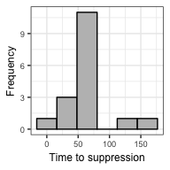

ushr: understanding suppression of HIV in R
================
Sinead E. Morris

<script type="text/x-mathjax-config">
MathJax.Hub.Config({
  TeX: { equationNumbers: { autoNumber: "AMS" } }
});
</script>
Introduction
------------

In 2017, HIV/AIDS was responsible for the deaths of one million people globally, including 50,000 children less than one year old (Global Burden of Disease Collaborative Network 2018b, Global Burden of Disease Collaborative Network (2018a)). Although mathematical modeling has provided important insights into the dynamics of HIV infection during anti-retroviral treatment (ART), there is still a lack of accessible tools for researchers unfamiliar with modeling techniques to apply them to their own datasets.

Here we present `ushr`, an open-source R package that models the decline of HIV during ART using a popular mathematical framework. `ushr` can be applied to longitudinal data of viral load measurements, and automates all stages of the model fitting process. By mathematically fitting the data, important biological parameters can be estimated, including the lifespans of short and long-lived infected cells, and the time to reach viral suppression below a defined detection threshold. The package also provides visualization and summary tools for fast assessment of model results.

More generally, `ushr` enables researchers without a strong mathematical or computational background to model the dynamics of HIV using longitudinal clinical data. Increasing accessibility to such methods may facilitate quantitative analysis across a wide range of independent studies, so that greater insights on HIV infection and treatment dynamics may be gained.

<!--In adult patients, mathematical modeling has provided many insights into the dynamics of HIV infection during treatment [@ho1995rapid, @perelson1997a, @wu1999biometrics, @Shet2016, @perelson1996hiv, @nowak2000book]. For example, simple frameworks describing the evolution of viral load (VL) have identified distinct populations of infected cells that decay at different rates and differentially impact overall viremia [@ho1995rapid, @perelson1997a, @wu1999biometrics, @Shet2016, @perelson1996hiv, @nowak2000book]. These models accurately capture the classic `biphasic' kinetics of viral decline, with an initial fast phase dominated by the rapid loss of short-lived infected cells (such as CD4 T cells), and a second slower phase driven by the loss of other long-lived infected populations [@ho1995rapid, @perelson1997a, @Markowitz2003]. Despite the extensive characterization of infected cell populations in adults on ART, -->
<!--However, much less is known about the corresponding dynamics in younger age groups. Hence there is a greater need for mathematical analysis of existing and future clinical data.Through this package, we provide a tool for researchers to model the dynamics of HIV infection in a cohort of patients undergoing ART. The package implements an established model for viral decay, and estimates the lifespans of key infected cell populations and the time at which patients achieve viral suppression. Overall, we hope this package will make mathematical modeling of clinical data more accessible, so that HIV dynamics may be better understood across all age groups.-->
Citing this package
-------------------

Citation information can be found using `citation("ushr")`; updated citations will be available in the upcoming paper: Morris SE et al. "ushr: understanding suppression of HIV in R".

<!--## Contributors

Luise Dziobek-Garrett and Andrew J Yates.-->
Getting further information
---------------------------

If you encounter any bugs related to this package please contact the package author directly. Additional descriptions of the model and analysis performed by this package will be available in the upcoming papers: Morris SE et al. "Quantifying the dynamics of HIV decline in perinatally-infected infants on ART"; Morris SE et al. "ushr: understanding suppression of HIV in R" (manuscripts available upon request from the package author). Further details on the mathematical theory can also be found in the references cited below. <!--Package documentation is also available from CRAN-->

Background
----------

### Guide to the mathematical model

HIV decline in a patient on ART is typically described using ordinary differential equations (ODEs) that characterize the production and spread of virus by infected target cells, such as CD4 T cells (Perelson et al. 1997, Wu and Ding (1999), Shet, Nagaraja, and Dixit (2016), Perelson et al. (1996), Nowak and May (2000)). Assuming ART completely blocks viral replication, and that viral dynamics occur on a faster timescale than those of infected cells, one can obtain the following expression for the timecourse of viral load, *V*, during treatment

<!--\begin{equation}-->
*V*(*t*)=*A*exp(−*δ**t*)+*B*exp(−*γ**t*).
 <!--\end{equation}--> Here *δ* and *γ* are the death rates of short and long-lived infected target cells, respectively (Shet, Nagaraja, and Dixit 2016). The parameters *A* and *B* are composite constants without direct interpretation; however, *A* + *B* represents the initial VL (i.e. *V*(*t* = 0)), and *A*/(*A* + *B*) can be understood as the proportion of infected cells at ART initiation that are short-lived.

Eqn. 1 is referred to as the biphasic model. According to this, viral load initially decays rapidly, reflecting the loss of short-lived infected cells (at rate *δ*), and then enters a second, slower decline phase reflecting the loss of longer-lived infected cells (at rate *γ*). For patient data exhibiting only one decline phase (for example, due to sparse or delayed VL measurements), one can use a single phase version of Eqn. 1 given by

where there are no assumptions on whether decay reflects the fast or slow phase of virus suppression.

### Time to suppression

For each individual, the time to reach virologic suppression below a defined threshold (\`time to suppression' (TTS)) can be estimated using both parametric and non-parametric methods. For the parametric approach, TTS was calculated as the first time at which *V*(*t*)=*x*, where *x* is the suppression threshold, and *V*(*t*) is given by Eqn. 1 for the biphasic model and Eqn. 2 for the single phase model. For the non-parametric approach, we first apply linear interpolation between the first measurement below the detection threshold and the preceding measurement. TTS is then defined as the time at which the interpolation line crosses the suppression threshold.

Implementation
--------------

### Data preparation

Raw clinical data is often noisy and sparse, making it unsuitable for mathematical analysis of viral decline, and eventual suppression, during ART. <!--For example, observations may be noisy and sparse; some individuals may reach suppression and others may not; and some may not experience consistent decline of viral load, due to factors such as drug resistance or poor adherence to treatment.--> Therefore, prior to any analysis, data must be processed to exclude individual trajectories that cannot be appropriately modeled. In `ushr`, we only consider individuals who reach suppression below a pre-defined threshold, within a particular timeframe (both specified by the user). By default, suppression is defined as having at least one viral load measurement below the detection threshold of the measurements assay, *d*. Alternatiely, the user may define suppression as sustaining at least two consecutive measurements below *d*. Following previous work, all measurements below the detection threshold are set to *d*/2 (Wu et al. 1999). To isolate the kinetics leading to initial suppression, viral load trajectories are truncated after the first measurement below *d*.

To distinguish 'true' decay dynamics from instances of viral rebound (due to factors such as drug resistance or poor treatment adherence), we only consider viral load data that maintain a consistent decreasing trend towards suppression, such that each measurement is within a pre-defined range of the previous measurement. This buffer range ensures that transient increases in viral load (arising from noise and measurement error) do not exclude subjects from the analysis. <!--Although the buffer could, in principle, allow gradual, sustained increases in viral load over time, such dynamics are unlikely to arise in individuals transitioning towards suppression.--> We also allow initial increases in viral load (for example, arising from pharmacological delays in drug action) by defining the beginning of each individual's decreasing sequence as the maximum value from their first three measurements.

<!--In addition to filtering and processing existing data according to the above inclusion criteria, \texttt{ushr} also provides functionality to simulate noisy data from the underlying mathematical model. We use such data below to verify the reliability of the fitting procedure.-->
### Model fitting

Parameter estimates with 95% confidence intervals are obtained for each subject by fitting either the biphasic or single phase model to the corresponding viral load data using maximum likelihood optimization (as described previously (Hogan et al. 2015)). Data are log**<sub>10</sub>-transformed prior to fitting and optimization is performed using `optim()`. After fitting, we use the resulting parameter estimates to calculate the lifespans of HIV-infected cells: 1/*δ* and 1/*γ* for short and long-lived infected cells from the biphasic model, respectively, and $1/\\hat{\\gamma}$ for the single phase model.

To improve parameter identifiability, only subjects with a minimum number of measurements above the detection threshold are fit using the biphasic or single phase models. These can be specified by the user, but we recommend at least six observations for the biphasic model and three for the single phase model. Individuals with fewer measurements are not included in the model fitting procedure, although they are still included in non-parametric TTS calculations. <!--Finally, as is common in sparse clinical data, some cases may have large differences in viral load between the first and second measurements, suggesting an unobserved transition from the fast to the slow decay phase. To prevent such occurrences biasing the estimated slope of decay when fitting the single phase model, we remove the first measurement if the difference in viral load is greater than a specified threshold. -->

Quick Start Example
-------------------

<!--To explain basic usage of the package and allow users to explore functionality, without needing their own dataset, we provide a function to simulate toy data. For example to simulate and plot data for fifteen subjects using the default `fixed' sampling method, we simply run-->
To illustrate basic usage of the package and allow users to explore functionality, we include a publicly available data set from the ACTG315 clinical trial. Briefly, the raw data consist of longitudinal HIV viral load measurements from 46 chronically-infected adults up to 28 weeks following ART initiation. The detection threshold was 100 copies/ml and observations are recorded as log<sub>10</sub> RNA copies/ml. These data are available at <https://sph.uth.edu/divisions/biostatistics/wu/datasets/ACTG315LongitudinalDataViralLoad.htm> (date originally accessed: 15 September 2019), and have been described previously (Lederman et al. 1998; Wu and Ding 1999; Connick et al. 2000).

### Data exploration

To begin, we load the package and print the first six rows to identify our columns of interest; these are the viral load observations ('log.10.RNA.'), the timing of these observations ('Day'), and the identifier for each subject ('Patid').

``` r
require(ushr)

print(head(actg315raw))
```

    ##   Obs.No Patid Day log10.RNA.    CD4
    ## 1      1     1   0     4.3617 221.76
    ## 2      2     1   2     4.3617 159.84
    ## 3      3     1   7     3.5315 210.60
    ## 4      4     1  16     2.9777 204.12
    ## 5      5     1  29     2.6435 172.48
    ## 6      6     1  57     2.1139 270.94

Since `ushr` requires absolute viral load measurments, and specific column names ('vl', 'time', 'id'), we first back-transform the log<sub>10</sub> viral load measurements into absolute values, and rename the column headings.

``` r
actg315 <- actg315raw %>%
    mutate(vl = 10^log10.RNA.) %>% 
    select(id = Patid, time = Day, vl)

print(head(actg315))
```

    ##   id time         vl
    ## 1  1    0 22998.5259
    ## 2  1    2 22998.5259
    ## 3  1    7  3400.1651
    ## 4  1   16   949.9484
    ## 5  1   29   440.0479
    ## 6  1   57   129.9870

We can then visualize this data using the `plot_data()` function.

``` r
plot_data(actg315, detection_threshold = 100)
```


Each panel represents a different individual, the points are the viral load measurements, and the dashed horizontal line is the assay detection threshold. From this we can see that the data is indeed noisy, individuals have different numbers of available observations, and only a subset suppress viral load below the detection threshold.

### Model fitting and output visualization

To fit the model to this data in just one line of code we use the `ushr()` function. This processes the data to filter out any individuals who do not meet the inclusion criteria defined above, and then fits either the single or biphasic model to each remaining trajectory, depending on the number of available observations (see the Background for more details). Note that the data processing step can be omitted using the `filter = FALSE` argument (default is TRUE); however this is not recommended unless rigorous processing efforts have already been made.

``` r
model_output <- ushr(data = actg315, detection_threshold = 100)
```

With the fitted model output, we can then plot both the biphasic and single phase fits as follows

``` r
plot_model(model_output, type = "biphasic", detection_threshold = 100)
```


``` r
plot_model(model_output, type = "single", detection_threshold = 100)
```


Again, each panel represents a different individual, points are the original data, and solid lines are the corresponding best-fit model. We can see that twelve subjects were successfully fit with the biphasic model, and four with the single phase model. Although some single phase subjects had sufficient data to fit the biphasic model (i.e. at least six observations), the resulting 95% parameter confidence intervals were either unattainable or sufficiently wide to indicate an unreliable fit. This can occur, for example, when one of the decay phases is poorly documented (i.e. has few data points). As a result, the subjects were re-fit with the single phase model. This re-fitting step is automated in the package; however, the user can control the size of confidence interval above which a biphasic fit is deemed unreliable using the argument `CI_max_diff` in `ushr()`.

We can also visualize a summary of the fitting procedure and parameter estimates using `summarize_model()`. This creates a list with the following elements: (i) a summary of which subjects were successfully fit using the biphasic or single phase models, with their corresponding infected cell lifespan estimates (`summary`); (ii) summary statistics for the estimated parameters from the biphasic model (`biphasicstats`); and (iii) summary statistics for the estimated parameters from the single phase model (`singlestats`).

``` r
actg315_summary <- summarize_model(model_output, data = actg315, stats = TRUE)

head(actg315_summary$summary)
```

    ##   id Included        Model ShortLifespan LongLifespan SingleLifespan
    ## 1  1      Yes     Biphasic          3.25        28.08               
    ## 2  2       No                                                       
    ## 3  3       No                                                       
    ## 4  4      Yes Single phase                                      14.3
    ## 5  5      Yes Single phase                                      4.22
    ## 6  6       No

``` r
actg315_summary$biphasicstats
```

    ## # A tibble: 6 x 4
    ##   Param              Median          SD Model   
    ##   <chr>               <dbl>       <dbl> <chr>   
    ## 1 A             135000      367000      Biphasic
    ## 2 B               1890        6540      Biphasic
    ## 3 delta              0.482       0.185  Biphasic
    ## 4 gamma              0.0391      0.0227 Biphasic
    ## 5 LongLifespan      25.6        11.9    Biphasic
    ## 6 ShortLifespan      2.08        0.834  Biphasic

``` r
actg315_summary$singlestats
```

    ## # A tibble: 3 x 4
    ##   Param             Median        SD Model       
    ##   <chr>              <dbl>     <dbl> <chr>       
    ## 1 Bhat           26900     23300     Single phase
    ## 2 gammahat           0.154     0.098 Single phase
    ## 3 SingleLifespan     9.1       5.76  Single phase

For a better understanding of parameter identifiability, one can also print the parameter estimates for each individual and model, along with their corresponding 95% confidence intervals.

``` r
head(model_output$biphasicCI) 
```

    ##   id param     estimate      lowerCI      upperCI
    ## 1  1     A 2.754517e+04 1.987918e+04 3.816738e+04
    ## 2  1 delta 3.076076e-01 2.283449e-01 4.143838e-01
    ## 3  1     B 1.174379e+03 7.013845e+02 1.966347e+03
    ## 4  1 gamma 3.560972e-02 2.829938e-02 4.480847e-02
    ## 5 13     A 3.853920e+05 3.002260e+05 4.947174e+05
    ## 6 13 delta 5.116112e-01 4.549242e-01 5.753618e-01

``` r
head(model_output$singleCI)     
```

    ##   id    param     estimate      lowerCI      upperCI
    ## 1  4     Bhat 1.621519e+03 5.480429e+02 4.797663e+03
    ## 2  4 gammahat 6.993061e-02 3.909354e-02 1.250920e-01
    ## 3  5     Bhat 4.223169e+04 1.962813e+04 9.086529e+04
    ## 4  5 gammahat 2.368478e-01 1.952923e-01 2.872457e-01
    ## 5 31     Bhat 1.158218e+04 8.791109e+03 1.525937e+04
    ## 6 31 gammahat 7.151531e-02 6.466642e-02 7.908956e-02

Time to suppression
-------------------

In addition to fitting the biphasic and single phase models, we can calculate the time to viral suppression (TTS) using both the parametric and non-parameteric methods (see the Background for more details). Here we set the suppression threshold to be the same as the detection threshold (i.e. we want to know when viral load drops below the detection threshold of the assay). First, to get parameteric estimates from the fitted model output, we use `get_TTS()` with the argument `parametric = TRUE`. We can subsequently obtain median and SD statistics, and the total number of subjects included in the analysis, using the `summarize()` function from `dplyr`.

``` r
TTSparametric <- get_TTS(model_output = model_output, parametric = TRUE, 
                             suppression_threshold = 100)
head(TTSparametric)
```

    ##   id       TTS    model calculation
    ## 1  1  69.17562 biphasic  parametric
    ## 2 13  48.70401 biphasic  parametric
    ## 3 17  73.09108 biphasic  parametric
    ## 4 19  64.95347 biphasic  parametric
    ## 5 26 122.11986 biphasic  parametric
    ## 6 27  69.81124 biphasic  parametric

``` r
TTSparametric %>% summarize(median = median(TTS), SD = sd(TTS), N = n())
```

    ##     median       SD  N
    ## 1 65.70076 30.98759 16

Alternatively, to calculate non-parametric TTS estimates, we set the argument `parametric = FALSE`, and supply the original data using `data = actg315`, rather than the fitted model output. The estimates are similar to those for the parametric method but, given the less stringent conditions for inclusion in the non-parametric analysis (there is no minimum requirement on the number of observations), we are able to estimate TTS for more subjects.

``` r
TTSnonparametric <- get_TTS(data = actg315, parametric = FALSE, 
                                suppression_threshold = 100)
head(TTSnonparametric)
```

    ## # A tibble: 6 x 3
    ##      id   TTS calculation   
    ##   <dbl> <dbl> <chr>         
    ## 1     1 69.8  non-parametric
    ## 2     2  6.89 non-parametric
    ## 3     4 43.3  non-parametric
    ## 4     5 27.7  non-parametric
    ## 5    13 54.0  non-parametric
    ## 6    17 77.9  non-parametric

``` r
TTSnonparametric %>% summarize(median = median(TTS), SD = sd(TTS), N = n())
```

    ## # A tibble: 1 x 3
    ##   median    SD     N
    ##    <dbl> <dbl> <int>
    ## 1   69.8  37.9    17

We can also plot the histograms for both methods using `plot_TTS()`.

``` r
plot_TTS(TTSparametric, bins = 6, textsize = 7)
```


``` r
plot_TTS(TTSnonparametric, bins = 6, textsize = 7)
```



Additional functionality
------------------------

`ushr` provides additional functionality to the examples documented here. For example, noisy clinical data can be simulated from an underlying biphasic model using the `simulate_data()` function. Further details of all functions and user-specific customizations can be found in the documentation.

References
----------

Connick, Elizabeth, Michael M. Lederman, Brian L. Kotzin, John Spritzler, Daniel R. Kuritzkes, Marty St. Clair, Anne D. Sevin, et al. 2000. “Immune Reconstitution in the First Year of Potent Antiretroviral Therapy and Its Relationship to Virologic Response.” *The Journal of Infectious Diseases* 181 (1): 358–63. doi:[10.1086/315171](https://doi.org/10.1086/315171).

Global Burden of Disease Collaborative Network. 2018a. “Global Burden of Disease Study 2017 (GBD 2017) Results.” <http://ghdx.healthdata.org/gbd-results-tool>.

———. 2018b. “Global, regional, and national age-sex-specific mortality for 282 causes of death in 195 countries and territories, 1980–2017: a systematic analysis for the Global Burden of Disease Study 2017.” *Lancet* 392 (10159): 1736–88. doi:[10.1016/S0140-6736(18)32203-7](https://doi.org/10.1016/S0140-6736(18)32203-7).

Hogan, Thea, Graeme Gossel, Andrew J Yates, and Benedict Seddon. 2015. “Temporal fate mapping reveals age-linked heterogeneity in naive T lymphocytes in mice.” *Proceedings of the National Academy of Sciences* 112 (50): E6917–E6926. doi:[10.1073/pnas.1517246112](https://doi.org/10.1073/pnas.1517246112).

Lederman, M. M., E. Connick, A. Landay, D. R. Kuritzkes, J. Spritzler, M. St. Clair, B. L. Kotzin, et al. 1998. “Immunologic Responses Associated with 12 Weeks of Combination Antiretroviral Therapy Consisting of Zidovudine, Lamivudine, and Ritonavir: Results of AIDS Clinical Trials Group Protocol 315.” *Journal of Infectious Diseases* 178 (1): 70–79. doi:[10.1086/515591](https://doi.org/10.1086/515591).

Nowak, Martin A, and Robert M May. 2000. *Virus Dynamics: Mathematical Principles of Immunology and Virology*. New York,USA: Oxford University Press.

Perelson, Alan S., Paulina Essunger, Yunzhen Cao, Mika Vesanen, Arlene Hurley, Kalle Saksela, Martin Markowitz, and David D. Ho. 1997. “Decay characteristics of HIV-1-infected compartments during combination therapy.” *Nature* 387 (6629): 188–91. doi:[10.1038/387188a0](https://doi.org/10.1038/387188a0).

Perelson, Alan S., Avidan U. Neumann, Martin Markowitz, John M. Leonard, and David D. Ho. 1996. “HIV-1 dynamics in vivo: viron clearance rate, infected cell life-span, and viral generation time.” *Science* 271 (5255): 1582–6. doi:[10.1126/science.271.5255.1582](https://doi.org/10.1126/science.271.5255.1582).

Shet, Anita, Pradeep Nagaraja, and Narendra M. Dixit. 2016. “Viral decay dynamics and mathematical modeling of treatment response: evidence of lower in vivo fitness of HIV-1 subtype C.” *J Acquir Immune Defic Syndr* 73 (3): 245–51. doi:[10.1097/QAI.0000000000001101](https://doi.org/10.1097/QAI.0000000000001101).

Wu, Hulin, and A Adam Ding. 1999. “Population HIV-1 dynamics in vivo: applicable models and inferential tools for virological data from AIDS clinical trials.” *Biometrics* 55 (2): 410–18.

Wu, Hulin, Daniel R Kuritzkes, Daniel R McClernon, Harold Kessler, Elizabeth Connick, Alan Landay, Greg Spear, et al. 1999. “Characterization of viral dynamics in human immunodeficiency virus type 1-infected patients treated with combination antiretroviral therapy: relationships to host factors, cellular restoration, and virologic end points.” *J Infect Dis* 179: 799–807.
