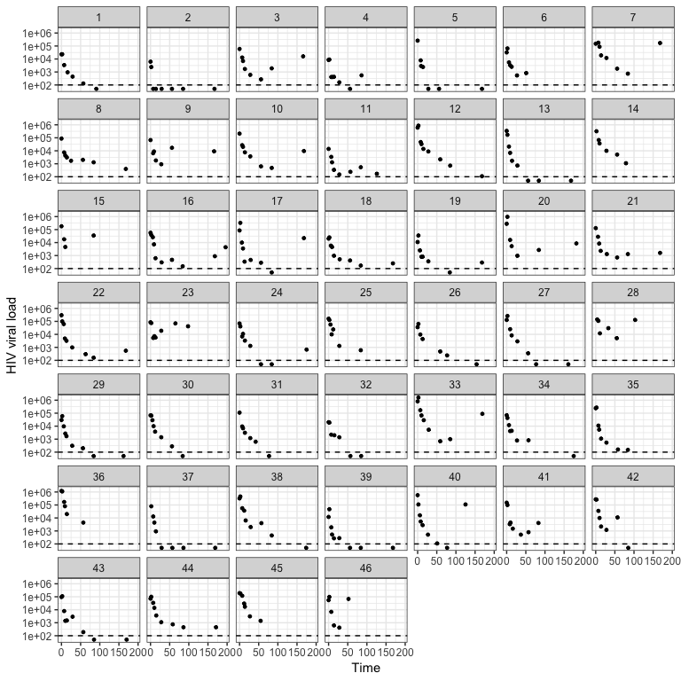
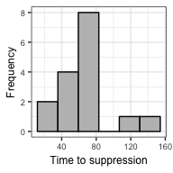

ushr: understanding suppression of HIV in R
================

[](https://travis-ci.com/SineadMorris/ushr)

Introduction
------------

In 2017, HIV/AIDS was responsible for the deaths of one million people globally, including 50,000 children less than one year old \[[1](#ref-GBD2017paper),[2](#ref-GBD2017web)\]. Although mathematical modeling has provided important insights into the dynamics of HIV infection during anti-retroviral treatment (ART), there is still a lack of accessible tools for researchers unfamiliar with modeling techniques to apply them to their own datasets.

`ushr` is an open-source R package that models the decline of HIV during ART using a popular mathematical framework. The package can be applied to longitudinal data of viral load measurements, and automates all stages of the model fitting process. By mathematically fitting the data, important biological parameters can be estimated, including the lifespans of short and long-lived HIV-infected cells, and the time to suppress viral load below a defined detection threshold. The package also provides visualization and summary tools for fast assessment of model results.

Overall, we hope `ushr` will increase accessibility to mathematical modeling techniques so that greater insights on HIV infection and treatment dynamics may be gained.

Author and Contributors
-----------------------

Sinead E Morris (author and maintainer), Luise Dziobek-Garrett (contributer) and Andrew J Yates (contributer).

Citing this package
-------------------

Citation information can be found using `citation("ushr")`; updated citations will be available in the upcoming paper: Morris SE et al. "ushr: understanding suppression of HIV in R".

Getting further information
---------------------------

If you encounter any bugs related to this package please contact the package author directly. Additional descriptions of the model and analysis performed by the package can be found in the vignette; details will also be available in the upcoming paper: Morris SE et al. "ushr: understanding suppression of HIV in R" (manuscript available upon request). Further details on the mathematical theory can also be found in the references cited below.

Background
----------

Please read the package vignette for full details on the mathematical model and its implementation in `ushr`, including data processing, model fitting, and parameter estimation.

### Brief guide to the mathematical model

HIV dynamics in an infected individual can be mathematically described as the production and spread of virus by two groups of infected target cells: so called 'short-lived' infected cells that die at a fast rate (such as CD4 T cells), and other 'long-lived' infected cells that die more slowly (**Fig A**).


Once ART has begun, the decline of HIV viral load, *V*, can be modelled using the following expression

*V*(*t*) = A exp(−*δ* *t*) + B exp(−*γ* *t*),

where *δ* and *γ* are the death rates of short and long-lived infected cells, respectively \[[3](#ref-perelson1996hiv)–[6](#ref-Shet2016)\]. This equation is referred to as the biphasic model: viral decay is fast initially, reflecting the loss of short-lived infected cells (at rate *δ*), but then enters a slower decline phase reflecting the loss of long-lived infected cells (at rate *γ*) (**Fig B**). Eventually, viral load is suppressed below the detection threshold of the experiment (dashed line, Fig B). Note that for patient data exhibiting only one decline phase (for example, due to sparse or delayed VL measurements), one can use a single phase version of the biphasic model given by

*V*(*t*)= B̂ exp(−γ̂ *t*),

where decay could reflect the fast or the slow phase of virus suppression.

By fitting the model, we can estimate the death rate parameters and use these to calculate the lifespans of infected cells: 1/*δ* and 1/*γ* for short and long-lived infected cells from the biphasic model, and 1/γ̂ for the single phase model. We can also estimate the time taken to suppress viral load ('time to suppression' (TTS)) by calculating the first time at which *V*(*t*)=*x*, where *x* is a user-defined suppression threshold, and *V*(*t*) is given by either the biphasic or single phase equation.

Quick Start Example
-------------------

To install the package from Github, first install and load `devtools`, then install `ushr` as follows

``` r
install.packages("devtools")
library("devtools")

install_github("SineadMorris/ushr", build_vignettes = TRUE)
```

The vignette can be viewed through

``` r
browseVignettes(package = "ushr")
```

To illustrate basic usage of the package, we include a publicly available data set from the ACTG315 clinical trial. The raw data (`actg315raw`) consist of longitudinal HIV viral load measurements from 46 chronically-infected adults up to 28 weeks following ART initiation. The detection threshold was 100 copies/ml and observations are recorded as log<sub>10</sub> RNA copies/ml. [These data are available online](https://sph.uth.edu/divisions/biostatistics/wu/datasets/ACTG315LongitudinalDataViralLoad.htm) (originally accessed 2019-09-15) and have been described previously \[[7](#ref-Lederman1998)–[9](#ref-Connick2000)\].

### Data exploration

To begin, we load the package and print the first six rows of the raw data to identify our columns of interest; these are the viral load observations ('log.10.RNA.'), the timing of these observations ('Day'), and the identifier for each subject ('Patid').

``` r
library(ushr)

print(head(actg315raw))
```

    ##   Obs.No Patid Day log10.RNA.    CD4
    ## 1      1     1   0     4.3617 221.76
    ## 2      2     1   2     4.3617 159.84
    ## 3      3     1   7     3.5315 210.60
    ## 4      4     1  16     2.9777 204.12
    ## 5      5     1  29     2.6435 172.48
    ## 6      6     1  57     2.1139 270.94

Since `ushr` requires absolute viral load measurements, and specific column names ('vl', 'time', 'id'), we first back-transform the log<sub>10</sub> viral load measurements into absolute values, and rename the column headings.

``` r
actg315 <- actg315raw %>%
    mutate(vl = 10^log10.RNA.) %>% 
    select(id = Patid, time = Day, vl)

print(head(actg315))
```

    ##   id time         vl
    ## 1  1    0 22998.5259
    ## 2  1    2 22998.5259
    ## 3  1    7  3400.1651
    ## 4  1   16   949.9484
    ## 5  1   29   440.0479
    ## 6  1   57   129.9870

We can then visualize this data using the `plot_data()` function.

``` r
plot_data(actg315, detection_threshold = 100)
```



Each panel represents a different individual and the dashed horizontal line is the assay detection threshold. We can see that the data is noisy, individuals have different numbers of observations, and only a subset suppress viral load below the detection threshold.

### Model fitting and output visualization

To fit the model to this data in just one line of code we use the `ushr()` function. This processes the data to filter out any individuals who do not suppression viral load, or who violate other inclusion criteria (described in the vignette), and then fits the model to each remaining trajectory. Note that only subjects with a minimum number of measurements above the detection threshold can reliably be fit. The number can be specified by the user, but we recommend at least six observations for the biphasic model and three for the single phase model.

``` r
model_output <- ushr(data = actg315, detection_threshold = 100)
```

With the fitted model output, we can then plot both the biphasic and single phase fits as follows

``` r
plot_model(model_output, type = "biphasic", detection_threshold = 100)
```


``` r
plot_model(model_output, type = "single", detection_threshold = 100)
```


The solid lines are the best-fit model for each subject. Twelve were successfully fit with the biphasic model, and four with the single phase model. Although some single phase subjects had sufficient data to fit the biphasic model (i.e. at least six observations), the resulting 95% parameter confidence intervals were either unattainable or sufficiently wide to indicate an unreliable fit. As a result, the subjects were automatically re-fit with the single phase model.

We can also summarize the fitting procedure and parameter estimates using `summarize_model()`. This creates a list with the following elements: (i) a summary of which subjects were successfully fit, with the corresponding infected cell lifespan estimates (`summary`); (ii) summary statistics for the biphasic model parameter estimates (`biphasicstats`); and (iii) summary statistics for the single phase parameter estimates (`singlestats`).

``` r
actg315_summary <- summarize_model(model_output, data = actg315, stats = TRUE)

head(actg315_summary$summary)
```

    ##   id Included        Model ShortLifespan LongLifespan SingleLifespan
    ## 1  1      Yes     Biphasic          3.25        28.08               
    ## 2  2       No                                                       
    ## 3  3       No                                                       
    ## 4  4      Yes Single phase                                      14.3
    ## 5  5      Yes Single phase                                      4.22
    ## 6  6       No

``` r
actg315_summary$biphasicstats
```

    ## # A tibble: 6 x 4
    ##   Param              Median          SD Model   
    ##   <chr>               <dbl>       <dbl> <chr>   
    ## 1 A             135000      367000      Biphasic
    ## 2 B               1890        6540      Biphasic
    ## 3 delta              0.482       0.185  Biphasic
    ## 4 gamma              0.0391      0.0227 Biphasic
    ## 5 LongLifespan      25.6        11.9    Biphasic
    ## 6 ShortLifespan      2.08        0.834  Biphasic

``` r
actg315_summary$singlestats
```

    ## # A tibble: 3 x 4
    ##   Param             Median        SD Model       
    ##   <chr>              <dbl>     <dbl> <chr>       
    ## 1 Bhat           26900     23300     Single phase
    ## 2 gammahat           0.154     0.098 Single phase
    ## 3 SingleLifespan     9.1       5.76  Single phase

For a better understanding of parameter identifiability, one can also print the parameter estimates for each individual and model, along with their corresponding 95% confidence intervals.

``` r
head(model_output$biphasicCI) 
```

    ## # A tibble: 6 x 5
    ##      id param    estimate     lowerCI     upperCI
    ##   <dbl> <chr>       <dbl>       <dbl>       <dbl>
    ## 1     1 A      27545.      19879.      38167.    
    ## 2     1 delta      0.308       0.228       0.414 
    ## 3     1 B       1174.        701.       1966.    
    ## 4     1 gamma      0.0356      0.0283      0.0448
    ## 5    13 A     385392.     300226.     494717.    
    ## 6    13 delta      0.512       0.455       0.575

``` r
head(model_output$singleCI)     
```

    ##   id    param     estimate      lowerCI      upperCI
    ## 1  4     Bhat 1.621519e+03 5.480429e+02 4.797663e+03
    ## 2  4 gammahat 6.993061e-02 3.909354e-02 1.250920e-01
    ## 3  5     Bhat 4.223169e+04 1.962813e+04 9.086529e+04
    ## 4  5 gammahat 2.368478e-01 1.952923e-01 2.872457e-01
    ## 5 31     Bhat 1.158218e+04 8.791109e+03 1.525937e+04
    ## 6 31 gammahat 7.151531e-02 6.466642e-02 7.908956e-02

Time to suppression
-------------------

To calculate the time to viral suppression (TTS) we use the fitted model output and the `get_TTS()` function (see the vignette for more details). Here we set the suppression threshold to be the same as the detection threshold (i.e. we want to know when viral load drops below the detection threshold of the assay). We can subsequently obtain median and SD statistics, and the total number of subjects included in the analysis, using the `summarize()` function from `dplyr`.

``` r
TTSparametric <- get_TTS(model_output = model_output, suppression_threshold = 100)
head(TTSparametric)
```

    ## # A tibble: 6 x 4
    ##      id   TTS model    calculation
    ##   <dbl> <dbl> <chr>    <chr>      
    ## 1     1  69.2 biphasic parametric 
    ## 2    13  48.7 biphasic parametric 
    ## 3    17  73.1 biphasic parametric 
    ## 4    19  65.0 biphasic parametric 
    ## 5    26 122.  biphasic parametric 
    ## 6    27  69.8 biphasic parametric

``` r
TTSparametric %>% summarize(median = median(TTS), SD = sd(TTS), N = n())
```

    ## # A tibble: 1 x 3
    ##   median    SD     N
    ##    <dbl> <dbl> <int>
    ## 1   65.7  31.0    16

We can also plot the distribution of estimates using `plot_TTS()`.

``` r
plot_TTS(TTSparametric, bins = 6, textsize = 7)
```



Additional functionality
------------------------

`ushr` provides additional functionality to the examples documented here. For example, noisy clinical data can be simulated from an underlying biphasic model using the `simulate_data()` function. We also provide an alternative, non-parametric method for estimating TTS that does not require prior model fitting. Further details of all functions and user-specific customizations can be found in the documentation.

References
----------

1 Global Burden of Disease Collaborative Network. **Global, regional, and national age-sex-specific mortality for 282 causes of death in 195 countries and territories, 1980–2017: a systematic analysis for the Global Burden of Disease Study 2017**. *Lancet* 2018; **392**:1736–1788.

2 Global Burden of Disease Collaborative Network. Global Burden of Disease Study 2017 (GBD 2017) Results. 2018.<http://ghdx.healthdata.org/gbd-results-tool> (accessed 21 Feb2017).

3 Perelson AS, Neumann AU, Markowitz M, Leonard JM, Ho DD. **HIV-1 dynamics in vivo: viron clearance rate, infected cell life-span, and viral generation time**. *Science* 1996; **271**:1582–1586.

4 Perelson AS, Essunger P, Cao Y, Vesanen M, Hurley A, Saksela K *et al.* **Decay characteristics of HIV-1-infected compartments during combination therapy**. *Nature* 1997; **387**:188–191.

5 Nowak MA, May RM. *Virus Dynamics: Mathematical Principles of Immunology and Virology*. New York,USA: Oxford University Press; 2000.

6 Shet A, Nagaraja P, Dixit NM. **Viral decay dynamics and mathematical modeling of treatment response: evidence of lower in vivo fitness of HIV-1 subtype C**. *J Acquir Immune Defic Syndr* 2016; **73**:245–251.

7 Lederman MM, Connick E, Landay A, Kuritzkes DR, Spritzler J, St. Clair M *et al.* **Immunologic Responses Associated with 12 Weeks of Combination Antiretroviral Therapy Consisting of Zidovudine, Lamivudine, and Ritonavir: Results of AIDS Clinical Trials Group Protocol 315**. *Journal of Infectious Diseases* 1998; **178**:70–79.

8 Wu H, Ding AA. **Population HIV-1 dynamics in vivo: applicable models and inferential tools for virological data from AIDS clinical trials**. *Biometrics* 1999; **55**:410–418.

9 Connick E, Lederman MM, Kotzin BL, Spritzler J, Kuritzkes DR, St. Clair M *et al.* **Immune Reconstitution in the First Year of Potent Antiretroviral Therapy and Its Relationship to Virologic Response**. *The Journal of Infectious Diseases* 2000; **181**:358–363.
